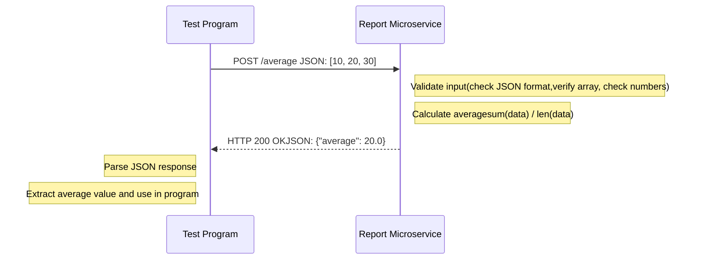

# Report Microservice

**Port:** 5003  
**Base URL:** `http://localhost:5003`

---

## Requirements

- Python 3.x
- Flask
- requests (for testing)

Install dependencies:
```bash
pip install flask requests
```

---

## Getting Started

**Start the microservice:**
```bash
python report-microservice.py
```

**Run the test suite:**
```bash
python test.py
```

---

## How to REQUEST Data

Send a POST request to one of these endpoints with a JSON array of numbers:

**Endpoints:**
- `/average` - Calculate average
- `/sum` - Calculate sum  
- `/minimum` - Find minimum value

**Example Call:**
```python
import requests

data = [10, 20, 30]
response = requests.post("http://localhost:5003/average", json=data)
```

**Request Requirements:**
- Method: POST
- Content-Type: application/json
- Body: JSON array of numbers (e.g., `[10, 20, 30]`)

---

## How to RECEIVE Data

The microservice returns a JSON object with the result.

**Example Response (Status 200):**
```python
result = response.json()
print(result)  # {'average': 20.0}
```

**Response Formats:**
- `/average` returns: `{"average": 20.0}`
- `/sum` returns: `{"sum": 60}`
- `/minimum` returns: `{"minimum": 10}`


---

## UML Sequence Diagram

